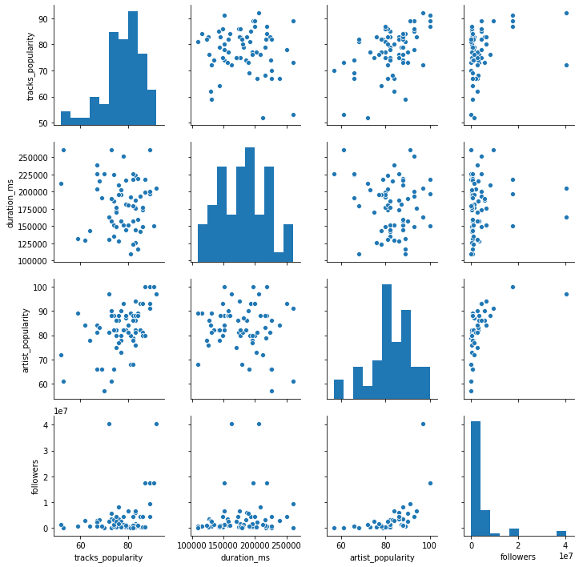
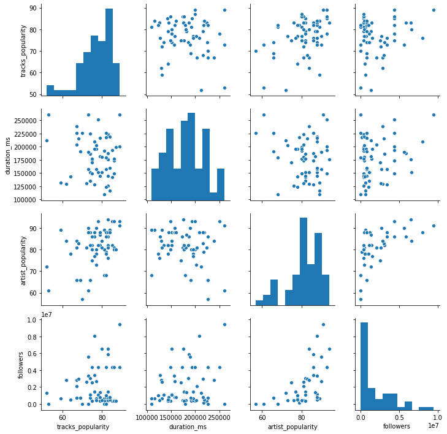

# Boilerplate code


```python
# Boilerplate codes. 
import os
import sys
import spotipy
import spotipy.util as util
import json

Spotify = spotipy.Spotify

## spotify account details
# os.environ['SPOTIPY_CLIENT_ID'] = 'your-spotify-client-id'
# os.environ['SPOTIPY_CLIENT_SECRET'] = 'your-spotify-client-secret'
# os.environ['SPOTIPY_REDIRECT_URI'] = 'your-app-redirect-url'

base_url = 'https://api.spotify.com'
scope = 'playlist-read-private'
# spotify:playlist:
token = util.prompt_for_user_token('vmdqlsl05lswg2mhyy1c9bece',scope=scope)
spotify_object = Spotify(auth=token)


```

# Creating database functions


```python
# Creating DataBase functions
import sqlite3
from sqlite3 import Error

## write some functions to create batabase table and insert values
def create_connection(db_file):
    """ create a database connection to the SQLite database
        specified by db_file
    :param db_file: database file
    :return: Connection object or None
    """
    conn = None
    try:
        conn = sqlite3.connect(db_file)
        return conn
    except Error as e:
        print(e)
 
    return conn
## Creating table function
def create_table(conn, create_table_sql):
    """ create a table from the create_table_sql statement
    :param conn: Connection object
    :param create_table_sql: a CREATE TABLE statement
    :return:
    """
    try:
        c = conn.cursor()
        c.execute(create_table_sql)
    except Error as e:
        pass

## function to insert values        
def insert_values(conn, sql_statement, values):
    """ create a table from the create_table_sql statement
    :param conn: Connection object
    :param create_table_sql: a CREATE TABLE statement
    :return:
    """
    try:
        c = conn.cursor()
        c.execute(sql_statement, values)
    except Error as e:
        pass
```


```python
def getting_playlist_data_to_database(playlist_id, playlist_owner, db, sql_table_statement, sql_value_statement):
    
    ## Getting a bit cleaned up. 
    results = spotify_object.user_playlist(playlist_owner, playlist_id)
    results = results['tracks']['items']
    
    ## initializing some lists.
    track_name = []
    track_popularity = []
    duration_ms = []
    artist_name = []
    track_id = []
    album_name = []
    release_date = []
    
    ## just going through the spotify object and retriving data. 
    for result in results:
        track_name.append(result['track']['name'])
        duration_ms.append(result['track']['duration_ms'])
        track_popularity.append(result['track']['popularity'])
        artist_name.append(result['track']['artists'][0]['name'])
        track_id.append(result['track']['id'])
        album_name.append(result['track']['album']['name'])
        release_date.append(result['track']['album']['release_date'])
        
    ## creating a connection with database
    conn = create_connection(db)
    create_table(conn, sql_table_statement)
    
    ## looping through all the lists and inserting values. 
    for i, n, p, d, at, alb, dt in zip(track_id, 
                                   track_name, 
                                   track_popularity, 
                                   duration_ms, 
                                   artist_name, 
                                   album_name, 
                                   release_date):
        values = (i, n, p, d, at, alb, dt)
        insert_values(conn, sql_value_statement, values)
        conn.commit()


```

# Table#1(tracks)


```python
results = spotify_object.search("Rap Caviar", limit = 1, type='playlist')
```


```python
# used this to have print readable spotify_object
# print (json.dumps(artist, sort_keys=True, indent=4))
```


```python
playlist_id =  results['playlists']['items'][0]['id']
playlist_owner = results['playlists']['items'][0]['owner']['id']
```


```python
sqlite_db = '360i_db.sqlite'

## Getting playlist id and owner name of the playlist(spotify)
playlist_id =  results['playlists']['items'][0]['id']
playlist_owner = results['playlists']['items'][0]['owner']['id']

## sql_command for creating table. 
sql_table = 'CREATE TABLE IF NOT EXISTS tracks(track_id CHAR(20) PRIMARY KEY, name TEXT, popularity INTEGER, duration_ms INTEGER, artist_name TEXT, album TEXT, release_date TEXT);'

## sql command for inserting values
value_statement = 'INSERT INTO tracks VALUES (?,?,?,?,?,?,?)'
```


```python
## this function creates database and inserts values. 
getting_playlist_data_to_database(playlist_id, playlist_owner, sqlite_db,sql_table, value_statement)
```

## Table#2 (Artists)


```python
results = spotify_object.user_playlist(playlist_owner, playlist_id)
results = results['tracks']['items']
```


```python
## Initializing a dict to store unique artist id and name. This is to avoid duplicates.  
artist_dict = {}
for result in results:
    for item in result['track']['artists']:
        if item['id'] in artist_dict:
            continue
        else:
            artist_dict[item['id']] = item['name']

## using the created dict above to get popularity and followers column. 
for key,value in artist_dict.items():
    artist_dict[key] = (value, spotify_object.artist(key)['popularity'], spotify_object.artist(key)['followers']['total'])

```


```python
## Creating 'artists' table
conn = sqlite3.connect(sqlite_db)
sql_statement = 'CREATE TABLE IF NOT EXISTS artists(artist_id CHAR(22) PRIMARY KEY, name TEXT, popularity INTEGER, followers INTEGER);'
create_table(conn, sql_statement)
```


```python
## Inserting values. 
for key, value in artist_dict.items():
    values = (key, value[0], value[1], value[2])
    insert_values(conn, 'INSERT INTO artists VALUES (?,?,?,?)', values)
    conn.commit()
```

## Analysis


```python
import pandas as pd
from pandas.io import sql

## Writing a little function to make our life a bit easier. 
def Q(input_string, db = conn):
#     return sql.read_sql(input_string, db)
    return pd.read_sql(input_string, db)


## How many songs are there in the tracks table. 
Q('SELECT COUNT(*) FROM tracks')
```


<div>
<style scoped>
    .dataframe tbody tr th:only-of-type {
        vertical-align: middle;
    }

    .dataframe tbody tr th {
        vertical-align: top;
    }

    .dataframe thead th {
        text-align: right;
    }
</style>
<table border="1" class="dataframe">
  <thead>
    <tr style="text-align: right;">
      <th></th>
      <th>COUNT(*)</th>
    </tr>
  </thead>
  <tbody>
    <tr>
      <td>0</td>
      <td>67</td>
    </tr>
  </tbody>
</table>
</div>


```python
## What are the top 5 tracks by artist follower count?
Q("""SELECT tracks."name" 
FROM tracks 
JOIN artists
ON tracks."artist_name" = artists."name"
ORDER BY artists."followers" DESC
LIMIT 5
""")
```


<div>
<style scoped>
    .dataframe tbody tr th:only-of-type {
        vertical-align: middle;
    }

    .dataframe tbody tr th {
        vertical-align: top;
    }

    .dataframe thead th {
        text-align: right;
    }
</style>
<table border="1" class="dataframe">
  <thead>
    <tr style="text-align: right;">
      <th></th>
      <th>name</th>
    </tr>
  </thead>
  <tbody>
    <tr>
      <td>0</td>
      <td>Behind Barz - Bonus</td>
    </tr>
    <tr>
      <td>1</td>
      <td>Money In The Grave (Drake ft. Rick Ross)</td>
    </tr>
    <tr>
      <td>2</td>
      <td>Enemies (feat. DaBaby)</td>
    </tr>
    <tr>
      <td>3</td>
      <td>On The Road (feat. Meek Mill &amp; Lil Baby)</td>
    </tr>
    <tr>
      <td>4</td>
      <td>Saint-Tropez</td>
    </tr>
  </tbody>
</table>
</div>


```python
## What are the top 5 tracks by artist follower count?
Q("""SELECT tracks."name", artists."name", artists."followers" 
FROM tracks 
JOIN artists
ON tracks."artist_name" = artists."name"
ORDER BY artists."followers" DESC
LIMIT 5
""")
```


<div>
<style scoped>
    .dataframe tbody tr th:only-of-type {
        vertical-align: middle;
    }

    .dataframe tbody tr th {
        vertical-align: top;
    }

    .dataframe thead th {
        text-align: right;
    }
</style>
<table border="1" class="dataframe">
  <thead>
    <tr style="text-align: right;">
      <th></th>
      <th>name</th>
      <th>name</th>
      <th>followers</th>
    </tr>
  </thead>
  <tbody>
    <tr>
      <td>0</td>
      <td>Behind Barz - Bonus</td>
      <td>Drake</td>
      <td>40526845</td>
    </tr>
    <tr>
      <td>1</td>
      <td>Money In The Grave (Drake ft. Rick Ross)</td>
      <td>Drake</td>
      <td>40526845</td>
    </tr>
    <tr>
      <td>2</td>
      <td>Enemies (feat. DaBaby)</td>
      <td>Post Malone</td>
      <td>17542578</td>
    </tr>
    <tr>
      <td>3</td>
      <td>On The Road (feat. Meek Mill &amp; Lil Baby)</td>
      <td>Post Malone</td>
      <td>17542578</td>
    </tr>
    <tr>
      <td>4</td>
      <td>Saint-Tropez</td>
      <td>Post Malone</td>
      <td>17542578</td>
    </tr>
  </tbody>
</table>
</div>


```python
## Which song is the longest?
Q("""SELECT name, MAX(duration_ms) FROM tracks
""")
```


<div>
<style scoped>
    .dataframe tbody tr th:only-of-type {
        vertical-align: middle;
    }

    .dataframe tbody tr th {
        vertical-align: top;
    }

    .dataframe thead th {
        text-align: right;
    }
</style>
<table border="1" class="dataframe">
  <thead>
    <tr style="text-align: right;">
      <th></th>
      <th>name</th>
      <th>MAX(duration_ms)</th>
    </tr>
  </thead>
  <tbody>
    <tr>
      <td>0</td>
      <td>No Cap (feat. Rich The Kid)</td>
      <td>260855</td>
    </tr>
  </tbody>
</table>
</div>


```python
## What is the relationship between track and artist popularity?
## Let's do a little analysis, 
df = Q("""SELECT tracks."popularity" as 'tracks_popularity', 
tracks."duration_ms", 
tracks."artist_name", 
artists."popularity" as 'artist_popularity',
artists."followers"
FROM tracks
JOIN artists
ON tracks."artist_name"= artists."name"
""")
```


```python
df.head()
```


<div>
<style scoped>
    .dataframe tbody tr th:only-of-type {
        vertical-align: middle;
    }

    .dataframe tbody tr th {
        vertical-align: top;
    }

    .dataframe thead th {
        text-align: right;
    }
</style>
<table border="1" class="dataframe">
  <thead>
    <tr style="text-align: right;">
      <th></th>
      <th>tracks_popularity</th>
      <th>duration_ms</th>
      <th>artist_name</th>
      <th>artist_popularity</th>
      <th>followers</th>
    </tr>
  </thead>
  <tbody>
    <tr>
      <td>0</td>
      <td>74</td>
      <td>151040</td>
      <td>Lil Nas X</td>
      <td>88</td>
      <td>1161728</td>
    </tr>
    <tr>
      <td>1</td>
      <td>72</td>
      <td>163120</td>
      <td>Drake</td>
      <td>97</td>
      <td>40526845</td>
    </tr>
    <tr>
      <td>2</td>
      <td>85</td>
      <td>193026</td>
      <td>Young Thug</td>
      <td>93</td>
      <td>4378724</td>
    </tr>
    <tr>
      <td>3</td>
      <td>85</td>
      <td>142417</td>
      <td>Quality Control</td>
      <td>82</td>
      <td>399764</td>
    </tr>
    <tr>
      <td>4</td>
      <td>83</td>
      <td>176640</td>
      <td>YNW Melly</td>
      <td>82</td>
      <td>1429516</td>
    </tr>
  </tbody>
</table>
</div>


```python
import matplotlib.pyplot as plt
import seaborn as sns
plt.subplots(figsize = (15,12))
sns.scatterplot(x = 'tracks_popularity', y = 'artist_popularity',size = 'followers', data = df);
```

As you can see there is a positive correlation between tracks and artists popularity. It seems as if popular artists tend to produce popular tracks. However, sometimes things  as you can see the top left data point

# Bonus Analysis


```python
sns.pairplot(df);
```





It looks like there are a couple of datapoint in the followers column, that are outliers. If we get rid off those couple of points we might be able to get a better look at the data. Let's find out those artist with top followers. 


```python
df.sort_values(by = 'followers', ascending = False).head(8)
```


<div>
<style scoped>
    .dataframe tbody tr th:only-of-type {
        vertical-align: middle;
    }

    .dataframe tbody tr th {
        vertical-align: top;
    }

    .dataframe thead th {
        text-align: right;
    }
</style>
<table border="1" class="dataframe">
  <thead>
    <tr style="text-align: right;">
      <th></th>
      <th>tracks_popularity</th>
      <th>duration_ms</th>
      <th>artist_name</th>
      <th>artist_popularity</th>
      <th>followers</th>
    </tr>
  </thead>
  <tbody>
    <tr>
      <td>8</td>
      <td>92</td>
      <td>205426</td>
      <td>Drake</td>
      <td>97</td>
      <td>40526845</td>
    </tr>
    <tr>
      <td>1</td>
      <td>72</td>
      <td>163120</td>
      <td>Drake</td>
      <td>97</td>
      <td>40526845</td>
    </tr>
    <tr>
      <td>15</td>
      <td>87</td>
      <td>218320</td>
      <td>Post Malone</td>
      <td>100</td>
      <td>17542578</td>
    </tr>
    <tr>
      <td>29</td>
      <td>91</td>
      <td>150866</td>
      <td>Post Malone</td>
      <td>100</td>
      <td>17542578</td>
    </tr>
    <tr>
      <td>5</td>
      <td>89</td>
      <td>196760</td>
      <td>Post Malone</td>
      <td>100</td>
      <td>17542578</td>
    </tr>
    <tr>
      <td>21</td>
      <td>89</td>
      <td>260640</td>
      <td>Chris Brown</td>
      <td>91</td>
      <td>9451625</td>
    </tr>
    <tr>
      <td>38</td>
      <td>76</td>
      <td>209120</td>
      <td>Future</td>
      <td>88</td>
      <td>8019644</td>
    </tr>
    <tr>
      <td>31</td>
      <td>80</td>
      <td>151066</td>
      <td>Big Sean</td>
      <td>84</td>
      <td>6539231</td>
    </tr>
  </tbody>
</table>
</div>


So, Drake and Post Malone are so far above and away from others that interms of followers that we may be better off leaving them out of the dataset. 


```python
df_followers = df[df.followers <17356258]

sns.pairplot(df_followers);
```





Well, If we look at the top right plot,we see that there are a cluster of datapoints where tracks_popularity is fairly high eventhough there isn't enough followers. However, the relationship between artist_popularity and tracks_popularity is quite significant as we have discussed earlier. May be if we have more data we can reveal something more significant.

# Bonus Data


```python
# results = spotify_object.search("biggest playlist ever.", limit = 10, type='playlist')
# results['playlists']['items']
```


```python
sqlite_db = '360i_db.sqlite'
## Getting playlist id and owner name of the playlist(spotify)
playlist_owner = 'maxmoroz07'
playlist_id = '7htu5ftbLBRFAwiuHVcUAg'

## sql_command for creating table. 
sql_table = 'CREATE TABLE IF NOT EXISTS tracks_100(track_id CHAR(20) PRIMARY KEY, name TEXT, popularity INTEGER, duration_ms INTEGER, artist_name TEXT, album TEXT, release_date TEXT);'

## sql command for inserting values
value_statement = 'INSERT INTO tracks_100 VALUES (?,?,?,?,?,?,?)'
```


```python
## this function creates database and inserts values. 
getting_playlist_data_to_database(playlist_id, playlist_owner, sqlite_db,sql_table, value_statement)
```

# Resources used
#### https://www.sqlitetutorial.net/sqlite-python/create-tables/ 
 
